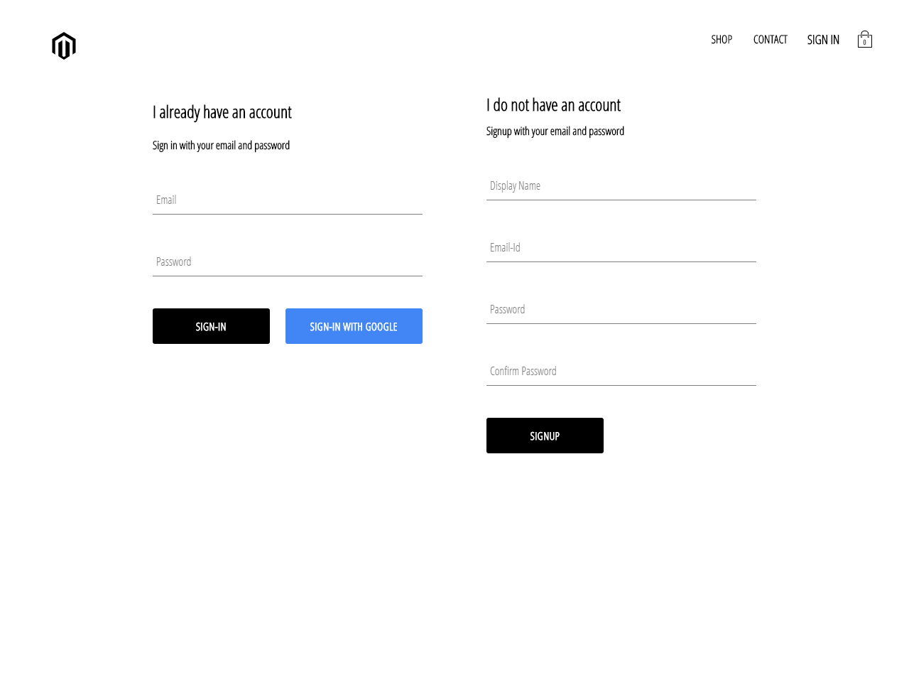
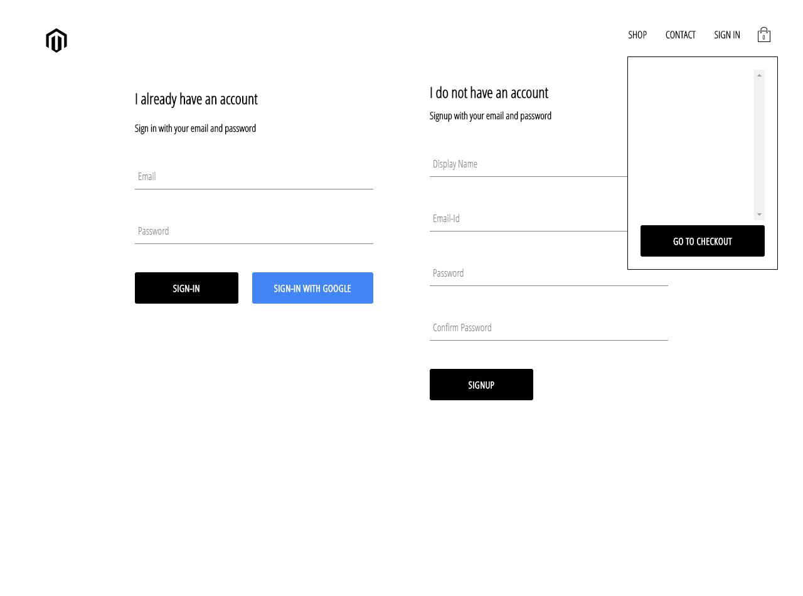

# <h1>Shop-Online</h1>

Here is the [link](https://charyyev2000.github.io/Shop-Online/)

An E commerce platform made using React JS, Redux, Firebase (authentication), Firestore, Stripe API (temporarily creating dummy payment gateway)

The application is composed of the following Features:

### Front-End
* A landing page with animated minimalistic design, with the major categories of items.
* A quick peek page where 5 products of each categories are on display.
* A page with Sign-in and Sign-out components.
* All form related fields are made using reusable components.
* Has a cart feature which opens up and displays the items selected in a summary, also has a checkout button.
* The cart component also allows to edit the contents of the items selected.
* Check out features are yet to be integrated into the appplication. 

### Firebase

* As of this moment I am using firebase for user authentication, also enabled google sign in authentication.
* It is also used to store user data 
* In the future it will also hold all shopping related and cart related dtaa of each user.

**SCREENSHOTS:**

Landing Page:

---
Product Preview:

---
Sign-in && Sign-Up Page:

Cart Section:

---

## Developed With

* [Visual Studio Code](https://code.visualstudio.com/) - A source code editor developed by Microsoft for Windows, Linux and macOS. It includes support for debugging, embedded Git control, syntax highlighting, intelligent code completion, snippets, and code refactoring
* [React](https://reactjs.org/) - A javascript library for building user interfaces
* [Create react app](https://create-react-app.dev/) - A quick method to start developing a react application.
* [Babel](https://babeljs.io/) - A transpiler for javascript
* [Webpack](https://webpack.js.org/) - A module bundler
* [SCSS](http://sass-lang.com/) - A css metalanguage

---

